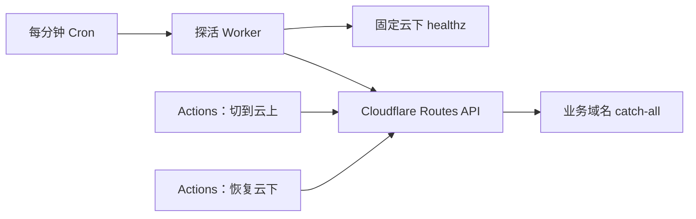

# 首次迁移、自动接管与手动恢复操作手册

- 文档日期：2026-09-06
- 状态：设计与操作约定，尚未实现或部署；本次没有读取或修改线上配置
- 适用域名：`rsshub-balancer.virworks.moe`
- 已确认范围：正常 RSS 与当前上游列表查询回云下，首页页面及桑基图内部接口留云上；独立 Worker 自动探活接管，两个 GitHub Actions 手动切换
- 简化决定：不引入 Durable Objects，也不使用 KV、Redis 或数据库保存切换状态；探活 Worker 与 Actions 分别直接调用 Cloudflare API

首次迁移只准备云上业务 Worker 和云下 Node 两侧配置，验证后在 Dashboard 手动修改 Workers Routes。探活 Worker、固定探活域名、探活凭证和两个切换 Actions 都在首次迁移完成后再添加，不作为第一次部署的前提。

当前仓库尚无 Node 入口、探活 Worker 或两个切换 workflow。下文的探活域名、配置名和文件名均为待实现设计。

## 流量开关

“99% 在云下”表示主要 RSS 流量回云下，首页页面、静态资源和桑基图内部接口留云上；不做 RSS 的 99:1 随机分配，也不修改应用已有的 fallback 比例。Zone Cache HIT 在边缘返回，MISS 才进入 Node。首页当前上游列表改由共享 `/api/upstreams` 返回，随同一 catch-all 开关切换承接环境，见 [前端方案](./frontend-worker-failover-plan.md#首页当前上游实例列表随承接环境切换)。

正常状态长期保留三条 Routes：

```text
rsshub-balancer.virworks.moe/             -> rsshub-balancer
rsshub-balancer.virworks.moe/_assets/*    -> rsshub-balancer
rsshub-balancer.virworks.moe/_internal/*  -> rsshub-balancer
```

只通过一条 catch-all 切换 RSS：

```text
rsshub-balancer.virworks.moe/* -> rsshub-balancer
```

| 操作 | Route 变化 | 结果 |
| --- | --- | --- |
| 切到云上 | 创建 catch-all；正确存在则跳过创建 | 当前业务 Worker 接管 RSS 与 `/api/upstreams` |
| 恢复云下 | 删除 catch-all；已不存在则只做验证 | RSS 经 Zone Cache 回云下 Node，禁止缓存的 `/api/upstreams` 也回到 Node |

日常切换不改 DNS、三条前端 Routes、Cache Rules 或 Redis key。业务 hostname 必须是指向云下入口的橙云 DNS，并且没有 Worker Custom Domain。首次迁移还要处理旧路径规则：更具体的 no-script 会挡住接管，旧的具体 Worker Route 会让部分 RSS 在恢复后仍上云。参见 [Routes 匹配规则](https://developers.cloudflare.com/workers/configuration/routing/routes/)和 [Custom Domains](https://developers.cloudflare.com/workers/configuration/routing/custom-domains/)。

## 自动接管：一个定时探活 Worker

本节及后续探活入口、切换 Actions 在首次迁移完成后实施。

新增 `rsshub-balancer-failover`，只运行 Cron，不绑定业务流量，也不提供手动控制 HTTP 接口。两个 Actions 直接访问 Cloudflare API，不经过探活 Worker；三者可复用同一份 Route 操作逻辑，分别执行。



每次 Cron 的流程：

1. 读取 Routes 并核对约定的匹配范围。自动写入已开启且 catch-all 正确存在时，保持接管并结束；只观察模式先按下文“公开路由验证”核对实际 Route 对应的公开来源，再继续探测固定云下入口，便于自动化接入时验证两种状态。
2. 请求固定云下入口的 `/healthz`。成功就结束；失败则等待 5 秒再试，**同一次 Cron 内最多探测 3 次**，任一次成功都结束本轮。
3. 三次都失败时，只观察模式记录结果并结束；自动写入已开启时，再次读取 Routes，确认没有异常绑定且尚未接管，再创建 catch-all。
4. 按下文“公开路由验证”重新读取 Routes，并通过业务 hostname 的公开 `/healthz` 分别核对执行来源和健康结果。允许有限等待边缘生效；验证失败时报告具体原因，保留接管 Route，不自动切回云下。

每次探测最多 10 秒，包含连接、响应头和受限大小的正文读取。失败计数仅在本轮有效，不跨 Cron 累计，不需要持久化存储。

Cron 使用 `* * * * *`。切换耗时包括等待下一轮、最多约 40 秒的本轮探测，以及 API 和边缘生效时间，不承诺秒级接管。Cron 配置变化也有传播时间，参见 [Cron Triggers](https://developers.cloudflare.com/workers/configuration/cron-triggers/)。

自动化始终只增加接管 Route，**不会因为云下恢复健康就自动删除它**。因此部署前手动切云上后，可以一直保持接管，直到操作者运行“恢复云下”。流向直接读取实际 Routes，原因留在 Worker 日志或 Actions 运行记录中。

探活 Worker 使用部署变量 `FAILOVER_ENABLED`，默认 `false`：关闭时只探测并记录日志，不写 Route；演练后改为 `true`。暂停时修改该变量并发布即可，日常云下部署无需暂停探活。缺配置、内部异常或 API 权限错误应直接报错，不当作云下故障或切换成功。

## 固定云下探活入口

建议使用普通橙云域名 `rsshub-balancer-probe.virworks.moe`，经同一 Traefik 到同一 Node 容器。它没有 Worker Custom Domain，也不命中任何 Worker Route，包括 zone 内的通配规则。

不能持续探测业务域名的 `/healthz` 来判断云下：接管后这个接口由云上 Worker 回答。固定探活入口则在两种流量状态下都检查云下。

探活接入维护在 `my-servers`，约定如下：

- Traefik 对探活 hostname 只暴露 `/healthz` 和 `/readyz`，其余返回 404；TLS 使用 Full (strict)，证书覆盖该 hostname，不新增 DNS-only 源站别名。
- 入口校验独立探活 token；Node 消费并移除该凭证，不转发给 RSSHub upstream。
- Node 的探针响应固定设置 `X-Balancer-Plane: origin`；业务域名的 `/healthz` 由各自 adapter 设置 `origin` / `worker`，供切换验证。该标记用于核对来源，不承担鉴权。
- 探针返回 `Cache-Control: no-store` 与 `Cloudflare-CDN-Cache-Control: no-store`，确认没有其他规则强制缓存。探测请求禁用缓存、拒绝重定向，校验响应无缓存命中证据。

`/healthz` 健康判定为 HTTP 200、正文去除首尾空白后为 `ok`、来源为 `origin`。网络错误、超时、其他状态、来源或正文不符均视为本次探测失败，并记录原因。

当前 [应用 `/healthz`](../../apps/server/src/index.ts) 检查的是“至少一个上游在单次 5 秒探测内健康”，不能证明所有 Feed 都可用；本次继续沿用。`/readyz` 用于 Node 配置与生命周期就绪检查，不因上游全部故障反复重启容器。新增探针需同步维护 [缓存方案](./zone-cache-plan.md)中的排除集合和响应头。

## 公开路由验证

本节为 2026-09-06 补充的待实施约定，与独立探活 Worker 和切换 Actions 一起在首次迁移完成后接入。它验证流量开关的实际效果，不改变现有 `/healthz` 的上游健康判断。

### 独立探活 Worker 的 fetch 配置

`rsshub-balancer-failover` 的 Wrangler 配置显式包含以下字段；如有其他必要 flag，合并保留：

```jsonc
{
  "compatibility_flags": ["global_fetch_strictly_public"]
}
```

该 flag 使全局 `fetch()` 按公网请求路由。Cloudflare 官方说明，未启用时，同 zone 请求可能按既有 origin 语义处理，绕过 URL 上的 Worker 与安全规则；不能仅凭调用了业务 URL 就认为验证了公开 Route。参见 [Fetch](https://developers.cloudflare.com/workers/runtime-apis/fetch/)和 [Global fetch() strictly public](https://developers.cloudflare.com/workers/configuration/compatibility-flags/#global-fetch-strictly-public)。

这里只为独立探活 Worker 固定公网验证语义，不给业务 Worker 增加该 flag，避免顺带改变已有上游请求的路由方式。纯 Cron、无 Route 的部署仍需按下述两种状态实测，不预先断言它一定触发 same-zone 限制。GitHub Actions 从 runner 访问公开 HTTPS URL，复用验证契约，不需要 Workers 兼容标志。

### 两类请求分别验证什么

| 请求目标 | 用途 | 预期来源 |
| --- | --- | --- |
| `https://rsshub-balancer-probe.virworks.moe/healthz`、`/readyz` | 判断云下健康与就绪，供接管判断和恢复前检查 | 两种流量状态下均为 `origin` |
| `https://rsshub-balancer.virworks.moe/healthz` | 验证业务 hostname 的公开路由实际到达哪一端 | 无 catch-all 时为 `origin`，接管时为 `worker` |

公开验证使用业务 hostname 的正常 DNS/TLS 入口，不使用 Host 覆盖、origin IP、`resolveOverride` 或内部直连。Service Binding、`workers.dev` 地址和直接调用 handler 可以验证某个 Worker 能执行，但都不能证明业务 hostname 的 catch-all 已生效。固定入口的探活 token 只发往约定的 probe hostname，公开 `/healthz` 沿用已有公开访问方式。

两类请求共用以下传输与响应检查：

- 使用 GET、`cache: 'no-store'` 和 `redirect: 'error'`，不跟随重定向。单次请求最多 10 秒，连接、响应头与正文读取共用同一个 deadline；正文最多读取 1 KiB，超限或超时即取消读取并记为验证失败。
- `/healthz` 的成功及不健康响应均由实际执行端设置 `X-Balancer-Plane`，并返回 `Cache-Control: no-store` 与 `Cloudflare-CDN-Cache-Control: no-store`。确认对应路径没有强制缓存规则；发现 HIT、STALE、UPDATING、REVALIDATED 或 `Age` 等缓存使用证据时，不接受其来源标记作为本次执行证据。缺少缓存状态头本身不代表验证失败。
- 分开记录“来源是否符合目标”和“是否健康”。HTTP 200、正文 trim 后为 `ok` 才算健康；`worker` 标记配合 503 表示已到 Worker 但健康检查失败，不能记成 Route 未生效。200 配合 `origin` 标记也不能算 Worker 接管成功。没有可信来源标记时，执行位置记为未知。

### API 读回与公开响应共同确认

Route API 读回用于确认控制面状态，公开响应用于确认实际请求去向，两项均通过才能报告切换成功：

1. 创建或删除后重新列出 Routes，核对 catch-all 的 pattern/script、是否存在，以及长期前端 Routes 和干扰规则。
2. 请求公开 `/healthz`，核对目标 plane，再核对 HTTP 状态和正文健康结果；两者分别写入 Worker 日志或 Action 摘要。
3. 控制面已符合目标、公开来源暂未一致时，可每隔 5 秒重查 Routes 并重新请求。验证阶段总时限暂定 30 秒，API 读回、公开请求和等待均计入；每次请求还受剩余总时限约束。这是本工具的等待上限，不是 Cloudflare 的全球生效承诺。
4. 到期仍不一致、出现未知绑定、API 无法核实或健康验证失败时，报告具体阶段和最后读回结果。自动接管保留已建立的 Route；恢复 Action 不自动执行反向写入，由操作者按既定应急流程处理。不能把 API 成功或单次来源正确当作全球所有边缘均已切换的证明。

上述等待只处理传播与结果核对，不消除 Cron 与 Actions 的竞态。普通 Feed 的验证仍沿用下文请求 ID 与平台日志核对，`/healthz` 不能代替代表性 Feed 验证。

### 自动化接入时的实测

保持 `FAILOVER_ENABLED=false` 时，由真实 Cron 在观察模式调用同一公开验证逻辑并记录结果；分别在无 catch-all 和已手动接管两种状态下，确认业务 `/healthz` 返回对应 plane，而固定 probe 始终到 Node。测试入口演练也必须复用上述 fetch 配置，不能只用本地定时器或手动 HTTP handler 代替真实 Cron 验证。

再验证来源不符、503、重定向、缓存响应、正文超限、完整请求超时和 API/公开响应暂不一致的处理；接管验证失败不得删除 catch-all。观察与演练通过后才开启自动写入。首次手动迁移仍使用原有健康接口、业务请求和日志，不要求提前部署本节自动化。

## 两个手动 GitHub Actions

两份 workflow 仅由 `workflow_dispatch` 触发，定义进入默认分支后，从 **Actions → 对应 workflow → Run workflow** 执行。它们不绑定镜像构建完成或 push 事件，参见 [GitHub 手动运行说明](https://docs.github.com/en/actions/how-tos/manage-workflow-runs/manually-run-a-workflow)。

| Actions | 拟定文件 | 执行步骤 |
| --- | --- | --- |
| **切到云上** | `.github/workflows/switch-to-cloud.yml` | 读取 Routes → 创建或确认 catch-all → 读回 → 验证公开 Worker 接管 |
| **恢复云下** | `.github/workflows/switch-to-origin.yml` | 验证固定云下入口 → 读取并删除 catch-all → 读回 → 验证公开云下服务 |

恢复前，固定入口 `/healthz` 需连续 3 次健康，间隔 5 秒，并确认 `/readyz` 返回 HTTP 200 和 `origin` 标记；采用相同的鉴权、超时与禁止缓存要求。云下新版本的代表性 Feed 和镜像版本由操作者提前直接验证。检查失败则不删除 Route。

两份 workflow 共用 `concurrency.group: rsshub-balancer-traffic-switch`，设置 `cancel-in-progress: false`。这只避免两个手动 Actions 同时执行，**不保证与 Cron 互斥**。操作者等上一次完成再执行下一次，参见 [GitHub concurrency](https://docs.github.com/en/actions/how-tos/write-workflows/choose-when-workflows-run/control-workflow-concurrency)。

首版接受这个取舍：写入前复查、写入后读回能发现部分冲突，但无法完全消除旧探测在手动恢复后又加回 Route 的情况。恢复后若重新被接管，先核对云下健康和探活日志，再重新运行“恢复云下”；不增加锁、代次或操作账本。

Action 按上述“公开路由验证”执行，只有在 Route 读回、公开来源与健康验证均通过后才成功，摘要列出目标流向、pattern/script、探活、执行来源及健康结果。失败或超时不自动执行反向操作；恢复后验证失败时，操作者运行“切到云上”，确认接管后再排查。

### 凭证与固定配置

探活 Worker 和 GitHub Actions 各自持有目标 zone 的 Cloudflare API token，通过 Worker Secrets 和 GitHub Actions Secrets 注入，权限为 **Workers Routes Write/Edit**。两侧均需注入探活 token；zone ID、业务 hostname、目标脚本和探活 URL 使用固定配置，不作为任意可输入的切换参数。

API token 的权限边界是 zone，代码再次限制只操作约定 catch-all。首次迁移读取及修改 DNS、Custom Domain 等资源使用另行准备的运维权限，Worker 部署凭证也与运行期 Route 凭证分开。token 不写日志或文档；后续脚本执行和依赖安装统一使用 pnpm。

## Cloudflare API 操作约定

API 基址：`https://api.cloudflare.com/client/v4`。

| 动作 | API | 核对内容 |
| --- | --- | --- |
| 列表 | `GET /zones/{zone_id}/workers/routes` | 读取完整结果，检查影响业务及探活 hostname 的匹配规则 |
| 接管 | `POST /zones/{zone_id}/workers/routes` | 固定 `pattern: rsshub-balancer.virworks.moe/*`、`script: rsshub-balancer` |
| 恢复 | `DELETE /zones/{zone_id}/workers/routes/{route_id}` | ID 来自本次列表，pattern/script 必须精确符合接管 Route |

接口与权限见 [List Routes](https://developers.cloudflare.com/api/resources/workers/subresources/routes/methods/list/)、[Create Route](https://developers.cloudflare.com/api/resources/workers/subresources/routes/methods/create/)、[Delete Route](https://developers.cloudflare.com/api/resources/workers/subresources/routes/methods/delete/)。

每次操作都重新查 Route，不把 ID 当永久配置。若发现未知脚本、旧 no-script 或其他会干扰目标的匹配规则，报错交人工核对，不批量覆盖或删除。相同目标重复运行时，已经符合目标就跳过写入，但仍验证结果。

API 请求设置有限超时，成功同时检查 HTTP 状态和 JSON `success: true`，随后再次列表确认。创建冲突、删除 404、429、5xx 或写入超时后，先读取现场，再决定是否有限重试；持续无法核实时报告“结果未知”。不把超时当成“没切过去”，也不据此盲目反向切换。

## 从旧配置首次迁到新配置

**首次部署只完成两侧应用配置和一次手动切换，不部署或演练探活接管自动化。** 准备期间保留原有入口提供服务，云下通过服务器本机或受控内部入口直接验证，无需新建探活域名或探活凭证。

| 步骤 | 操作与通过条件 |
| --- | --- |
| **1. 保存现场** | 读取 Routes、Custom Domains、DNS、相关缓存/重定向规则及 `my-servers` 有效配置；记录受影响规则和旧版本，保存受控回滚备份 |
| **2. 准备云上配置** | 保留当前前端与后端组合 Worker，完成迁移所需的 `worker:` 状态隔离、内部接口和指标 ingest，增加共享 `/api/upstreams`；验证云上版本可用，准备期间保留旧首页读取与旧列表接口行为 |
| **3. 准备云下配置** | 完成 Node 入口、构建、环境与后台任务适配，在 `my-servers` 配置单实例 Compose、Traefik 和 TLS；初始化 `origin:` 状态，不复制旧共享失败标记。直接验证版本、就绪、Feed GET/HEAD、`/api/upstreams` 与选路使用的列表一致、指标回传及响应缓存头；两端新列表接口及公开新路径验证通过后，再更新首页读取地址和旧列表接口的过渡重定向 |
| **4. 手动切到新路由** | 在 Cloudflare Dashboard 建立三条长期前端 Routes，确认橙云 DNS 经 Traefik 指向 Node、业务 Custom Domain 已移除，并整理旧路径规则；手动删除业务 catch-all，让普通 RSS 回云下 |
| **5. 核对结果** | 重新读取配置，确认只保留约定的前端 Routes；验证 RSS MISS 到 Node、Zone Cache 可用、首页页面和桑基图内部接口仍在 Worker，重新加载首页取得 Node 当前实例列表，并通过 Node/Traefik 日志核实执行位置 |

第 4 步若仍有 Custom Domain，先准备 zone Route、云下反代和证书，再移除该绑定并立即读取 DNS；若原 DNS 随之删除，补建橙云记录。转换期间可手动保留指向原业务 Worker 的 catch-all，准备完成后再手动删除。这些均是 Dashboard 配置操作，不需要部署探活 Worker 或 Actions。跨资源转换不是原子操作，失败时按现场备份恢复受影响资源。

还要确认云下实际目标已从旧 [路径旁路方案](../cloudflare-origin-bypass.md)中的直接 RSSHub 改为 Node balancer。按 [前端方案](./frontend-worker-failover-plan.md)处理带 query 首页和 `/index.html`，不能为此常驻 catch-all。Routes 继续在 zone 级管理，不写回业务 Worker 的 `wrangler.jsonc`。

应用准备沿用 [Node 部署分析](./node-hono-deployment-analysis.md)、[Compose 发布方案](./origin-release-plan.md)、[桑基图方案](./sankey-analytics-engine-ingestion-plan.md)和 [Zone Cache 方案](./zone-cache-plan.md)。首次切云下失败时，在 Dashboard 手动恢复指向原业务 Worker 的 catch-all 并核对；不调用切换 Action。

第 5 步通过即完成首次迁移。首次验收使用现有健康接口、业务请求和日志，不要求自动化专用的来源标记、探活 token 或故障演练。

## 首次迁移完成后再添加自动化

1. 建立固定云下探活入口，补充来源标记、探活鉴权与禁止缓存约定，直接验证请求确实到达 Node。
2. 部署显式启用 `global_fetch_strictly_public` 的独立探活 Worker，保持 `FAILOVER_ENABLED=false`；按“公开路由验证”完成真实 Cron 的两状态观察，配置两个切换 Actions 及其凭证。
3. 在测试入口演练本轮三次失败接管、健康不自动恢复、手动切换、公开验证与 API 失败处理。验证业务由 Worker 服务时，固定探活仍只反映云下状态，来源与健康结果分别记录。
4. 设置 `FAILOVER_ENABLED=true` 并核对真实 Cron 执行结果，再记录自动接管已启用。

## 日常发布、恢复与应急

以下 Actions 流程适用于自动化已接入之后。在首次迁移完成、Actions 尚未添加的阶段，同样通过 Dashboard 手动增删 catch-all，再核对请求去向。

1. 准备新镜像，记录上一版 digest 和配置，提前拉取。
2. 运行 **切到云上**，确认接管成功后再停止旧 Node；结果未知时暂停发布。
3. 按 Compose 发布方案更新 Node，让在途请求收尾；不要停止共享 Traefik、Redis 或 Worker 仍使用的上游服务。
4. 直接验证新 Node 的版本、就绪及代表性 Feed。失败则保持云上并回滚旧镜像。
5. 运行 **恢复云下**，确认 Route 与公开入口；失败时根据实际流向运行“切到云上”并核对。

自动故障接管后，同样先修复和直接验证云下，再运行“恢复云下”。查看实际 Routes、探活 Worker 日志和 Actions 摘要判断结果；云下恢复健康不会自行移动流量。

GitHub Actions 或探活 Worker 不可用时，可直接在 Cloudflare Dashboard/API 操作同一 catch-all。应急恢复前先验证云下；必要时关闭 `FAILOVER_ENABLED` 或停用 Cron，并确认配置生效及旧执行结束。暂停配置不保证立即终止在途任务，应急操作后仍需读回核对。

## 验证与已接受边界

- **自动化接入后的日常验证：** 按“公开路由验证”核对 Route、无缓存的公开 `/healthz` 来源及健康结果；代表性 Feed 状态、响应头和内容正确。固定探活始终只反映云下。
- **首次迁移、演练及排障：** 操作者通过请求 ID 对照 Worker 或 Node/Traefik 日志，确认未命中缓存的 Feed 在目标环境执行；不增加跨平台日志读取系统。
- **首页当前实例列表：** 以两端不同的列表核对 `/api/upstreams`，正常、接管及恢复后重新加载首页分别显示 Node、Worker、Node 列表；旧 `/_internal/upstreams` 重定向后应取得相同结果。列表不作为健康探针或切换判定依据。
- **缓存：** 切换不清空或迁移 Zone Cache 与 Workers Cache。缓存 HIT 和桑基图不能单独证明当前执行位置；必要时仅清理明确的测试 Feed URL，避免全 zone purge。
- **备用端验证失败：** 保留接管 Route，记录失败并排查，不自动回到已知故障的云下。接管只移动 balancer 执行位置，固定 fallback、Redis 和上游仍可能存在共享故障，沿用已接受的业务语义。
- **并发：** 不保证 Cron 与 Actions 严格互斥；保留复查和读回，异常时人工复核并重跑所需 Action。

后续实现重点验证：正常不写 Route、本轮三次失败接管、中途成功结束本轮、已接管不重复创建、云下健康不自动恢复、重复切换目标无需重复写入、未知绑定不被覆盖，以及 API 超时后先读回再处理。
